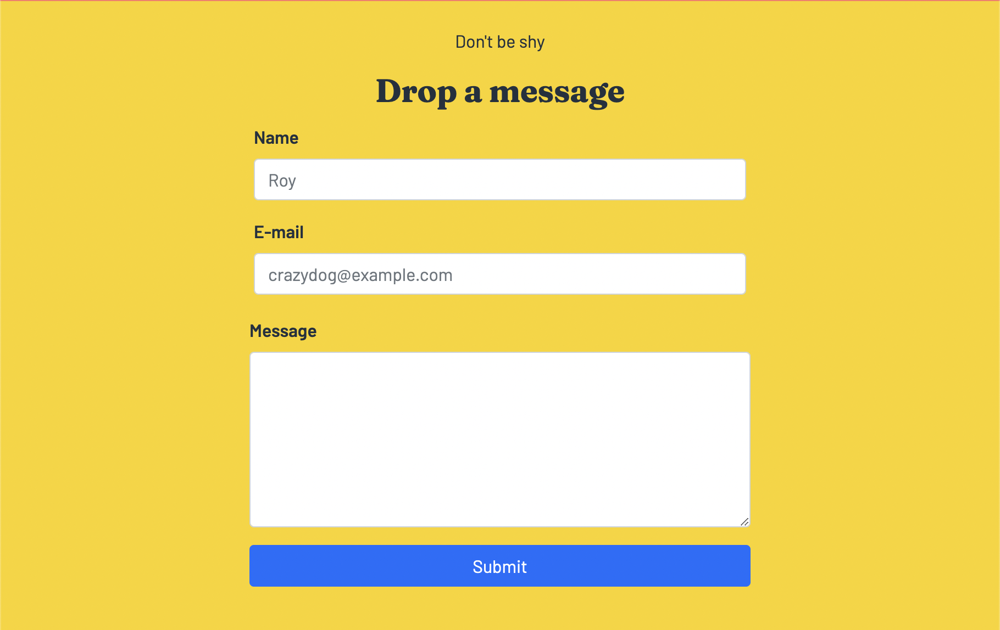
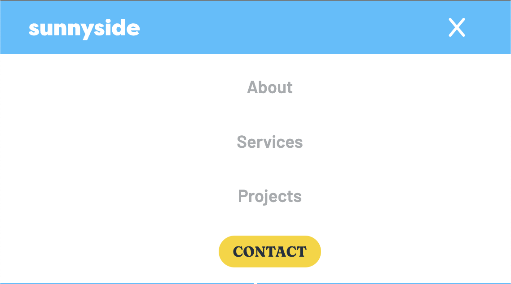
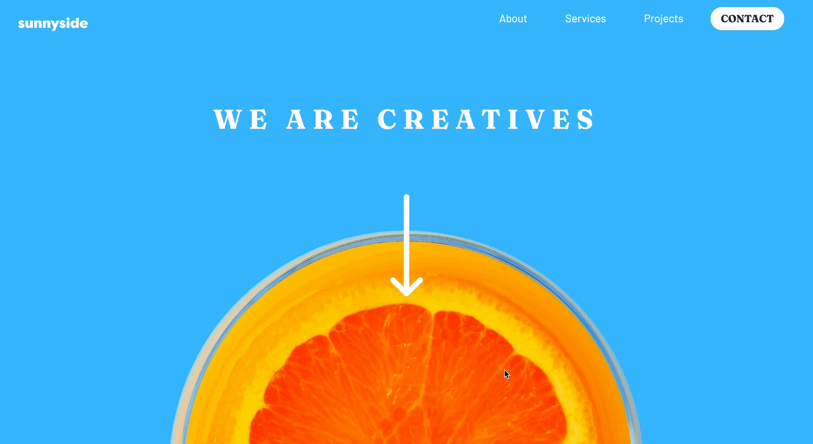

# Projeto de Linguagens de Marcação - IFPB

## Olá! 👋

Este projeto foi baseado no em um dos muitos exercícios do [Frontend Mentor](https://www.frontendmentor.io), uma plataforma de desafios onde além de aprender e aprimorar suas habilidades de Front-end. Funciona como um rede-social colaborativa, onde são oferecidos vários desafios, gratuitos e pagos, do nível iniciante ao guru. E ao completar o desafio é possível receber feedbacks de outros usuários.

**Para realizar este desafio utilizamos HTML, SASS e um pouquinho de JS**

## O desafio

Não fugimos muito do design proposto pela plataforma, a única modificação que fizemos foi adicionar uma seção utilizando recurso da web, através da tag iframe, que era um dos requisitos propostos pelo professor.

**Por que utilizamos SASS?**

Para maior facilidade no trabalho colaborativo, utilizamos o SASS, que não é muito diferente da sintaxe do CSS. Não usamos nem um terço das suas funcionalidades do SASS como mixins ou funções, o principal foco foi a divisão de tarefas através da organização em pastas e utilização de variáveis.

**JS**

Nada muito avançado, apenas fizemos manipulação através do DOM para fazer o famoso menu responsivo.

## Segunda etapa do Projeto

- Uso de, pelo menos, um formulário, com diferentes de tipos de entradas de dados nos formulários (inputs); ✅
- Uso de animação ou transição; ✅
- Realizar posicionamento de, pelo menos, um elemento HTML (relative, absolute, fixed ou sticky); ✅
- Estilização da página usando alguma biblioteca de componentes como o Bootstrap. ✅

Todos os requisitos necessários já tinham sido realizados na primeira etapa do projeto, com exceção do formulário e da biblioteca de estilo.

**Formulário e Bootstrap**

Para cumprir com esses requisitos, adicionei uma nova seção **#contact** onde adicionei um formulário de contato e o estilizei com o uso da biblioteca Bootstrap. O formulário conta com um campo de texto, um de e-mail, uma text-area e um botão tipo submit.

**Animação e Posicionamento**

Estes requisitos já tinham sido cumpridos na primeira versão do projeto e podem ser encontrados:

- Na #nav no modo responsivo, onde conta com um posicionamento absoluto e uma transição.

- No #home, onde existe uma imagem de uma seta (#arrow-down) com posicionamento absoluto e uma animação de transformaçao no eixo y.

Discentes:

Rafael Limeira  
Matrícula: 20222370020

Mattheus Teixeira  
Matriícula: 20222370018

## 🔗 [Projeto Sunnyside](https://buenorafa.github.io/sunnyside-agency-landing-page-main/)
